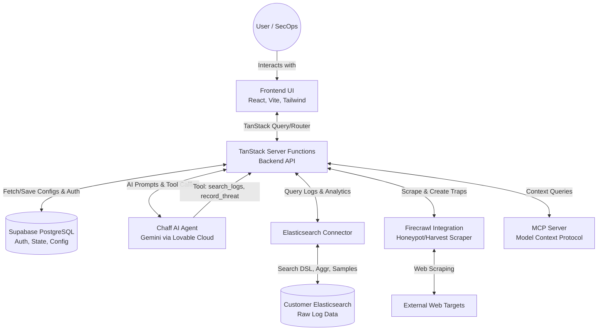

# Chaff
**Autonomous bot-traffic analyst powered by AI and your Elasticsearch logs. Separate humans from bots.**

Chaff acts as your autonomous Tier-1 Security Analyst. Instead of staring at dashboards and raw logs, Chaff connects directly to your Elasticsearch instance, allowing an advanced AI Agent (powered by Gemini) to investigate scrapers, credential stuffing, and scanners in real-time. It provides actionable threat intelligence, creates automated honeypots, and helps you block malicious traffic at the edge.

[**Read the Full Technical Documentation**](./TECHNICAL_DOCUMENTATION.md)

---

## System Architecture

<div align="center">
  <h3>Chaff Data Flow & Architecture</h3>
</div>



### Flow by Flow Explanation
1. **User Authentication & Initialization:** The User accesses the React frontend UI and is authenticated via Supabase. The user is prompted to connect their data source.
2. **Connecting to External Data:** The user inputs their Elasticsearch credentials. The server tests the connection and securely saves the configuration.
3. **Data Analysis via Chaff Agent:** The user queries the Chaff Agent. The Agent constructs a system prompt and loops through native tools (`search_logs`, `sample_requests`) to query the Customer's Elasticsearch logs directly via the backend server functions.
4. **Recording Threats:** The Agent identifies bots and records findings to the Supabase database using the `record_threat` tool. The React frontend visualizes these on the Dashboard.
5. **Honeypot Creation:** To proactively catch bots, Chaff uses the Firecrawl API to crawl target sites and generate deceptive trap pages.
6. **Block Rules & Mitigation:** Identified threats result in Block Rules stored in Supabase, ready to be exported to external WAFs.
7. **Extensibility:** The MCP (Model Context Protocol) Server exposes threat intelligence context to local AI developer tools.

---

## Tech Stack
* **Frontend:** React, Vite, Tailwind CSS, TanStack (Router, Query, Start), Recharts, Radix UI, Framer Motion
* **Backend:** TanStack Server Functions, Node.js
* **Database & Auth:** Supabase (PostgreSQL, Edge Functions)
* **AI & Intelligence:** Lovable AI (Google Gemini 3 Flash Preview)
* **Log Integration:** Elasticsearch
* **External Scraper/Honeypot Integrations:** Firecrawl (`@mendable/firecrawl-js`)

---

## Detailed Setup Instructions

Follow these exact baby steps to get Chaff running on your local machine.

### 1. Clone the repository
Copy and paste the following commands into your terminal to clone the repository and navigate into the directory:
```bash
git clone https://github.com/lovable-dev/chaff.git
cd chaff
```
*(Note: adjust the repository URL to your exact remote URL if different)*

### 2. Install dependencies
Install all required Node packages using npm:
```bash
npm install
```

### 3. Configure environment
The standard `.env` file is auto-managed by Lovable Cloud and includes your Supabase connections. Ensure your environment has the following setup (you can check your `.env` template):
```
VITE_SUPABASE_URL=your_supabase_url
VITE_SUPABASE_PUBLISHABLE_KEY=your_supabase_anon_key
VITE_SUPABASE_PROJECT_ID=your_supabase_project_id
```

### 4. Add required secrets
To enable the Honeypot and web scraping functionalities, you must add the Firecrawl secret. In Lovable Cloud (or your local `.env`), add the following secret:
```
FIRECRAWL_API_KEY=your_firecrawl_api_key
```

### 5. Run the development server
Start the local Vite development server:
```bash
npm run dev
```

### 6. Access the App
Open `http://localhost:8080` (or the port provided by Vite in your terminal) in your web browser. Click the sign-in button and **Sign up with Google** to create an account and begin using Chaff.

---

## How to Use the Application

This step-by-step walkthrough will guide you perfectly through using Chaff.

### Step 1: Initial Login
When you open the application in your browser, you will see a login screen. Click the **"Sign up with Google"** button to authenticate and access the dashboard.

### Step 2: Activate Chaff (Connecting Elasticsearch)
Upon first login, the Agent cannot function without data.
1. Navigate to the **"Onboard"** tab (or click the **Activate Chaff** button if prompted by the empty state).
2. Enter your Elasticsearch credentials:
   - **Endpoint URL** (e.g., `https://your-cluster.es.us-central1.gcp.cloud.es.io:9243`)
   - **API Key**
   - **Index Pattern** (e.g., `logs-web-*` or `filebeat-*`)
   - **Field Mappings:** Ensure the fields for IP (`client.ip`), User-Agent (`user_agent.original`), URL/Path (`url.path`), Timestamp (`@timestamp`), and Status Code (`http.response.status_code`) match your Elasticsearch schema.
3. Click to save and test the connection.

### Step 3: Utilize the Chaff Agent
With data flowing, it's time to investigate.
1. Click on the **"Agent"** tab in the sidebar.
2. You will be greeted by the Chaff AI. You can click on a suggested prompt like *"Investigate any unusual spikes in the last 24h"* or type your own question.
3. The Agent will autonomously execute tools, fetch real logs from your connected Elasticsearch instance, and return a comprehensive report classifying bots and identifying specific IP addresses.
4. If the Agent identifies a severe threat, it will automatically record it to your system.

### Step 4: Review Threats
1. Click on the **"Threats"** tab to view your dashboard.
2. Here, you will see visual charts of your traffic, distinguishing between "Human" and "Bot" requests.
3. Below the charts, review the list of recorded threats identified by the Agent, including their severity, origin IP, and the exact tools used by the bots.

### Step 5: Deploy Honeypots
1. Click on the **"Honeypots"** tab.
2. Enter a target URL (your main website URL). Chaff will utilize Firecrawl to analyze your site's structure.
3. Generate deceptive Trap pages (e.g., a fake `/admin/login` page). Deploy these traps on your site. Any traffic that hits these hidden URLs will be immediately flagged as malicious in your dashboard.

### Step 6: Create Campaigns & Harvest Intel
- **Campaigns:** Navigate to the **Campaigns** tab to set up long-running monitors for specific endpoints, allowing you to track suspicious activity over days or weeks.
- **Harvest:** Navigate to the **Harvest** tab to run deep IP intelligence gathering on the malicious IPs you have found, determining if they belong to VPNs, Datacenters, or Tor nodes.
