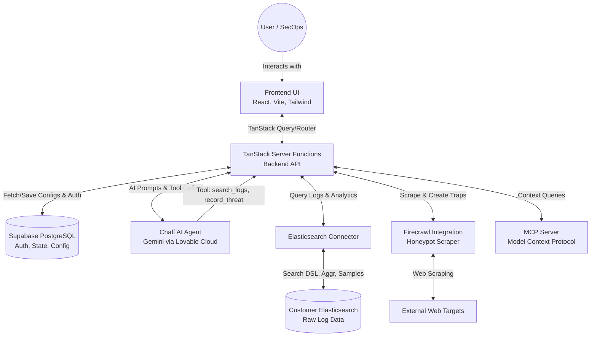

# Chaff - Technical Documentation

## Executive Summary

Chaff is an autonomous bot-traffic analyst and security mitigation system designed to detect and separate malicious bots (such as scrapers, credential stuffers, and scanners) from legitimate human traffic. By connecting directly to an organization's existing Elasticsearch logs, Chaff utilizes a sophisticated AI agent powered by Gemini (via Lovable Cloud) to continuously monitor, analyze, and report on traffic patterns. It provides actionable threat intelligence, creates automated honeypots using Firecrawl, and enables active mitigation through IP and User-Agent blocking rules.

## Table of Contents

1. [Executive Summary](#executive-summary)
2. [System Architecture](#system-architecture)
   - [Architecture Diagram](#architecture-diagram)
   - [Flow by Flow Explanation](#flow-by-flow-explanation)
3. [Detailed Feature & Agent Breakdown](#detailed-feature--agent-breakdown)
   - [The Chaff Agent (Autonomous AI Analyst)](#the-chaff-agent-autonomous-ai-analyst)
   - [Elasticsearch Integration & Dashboard (Threats)](#elasticsearch-integration--dashboard-threats)
   - [Honeypots & Traps](#honeypots--traps)
   - [Campaigns](#campaigns)
   - [Live View](#live-view)
   - [Block Rules & Mitigation](#block-rules--mitigation)
   - [MCP (Model Context Protocol) Server](#mcp-model-context-protocol-server)
4. [Conclusion](#conclusion)

---

## System Architecture

### Architecture Diagram

### Flow by Flow Explanation

1. **User Authentication & Initialization**
   - The User accesses the application and is authenticated via **Supabase Auth** (handled by `@lovable.dev/cloud-auth-js`).
   - The React frontend establishes a secure session. The user is prompted to connect their data source in the **Onboarding** flow.

2. **Connecting to External Data (Elasticsearch)**
   - The user inputs their Elasticsearch endpoint, API key, index pattern, and field mappings (`timestamp_field`, `ip_field`, `user_agent_field`, `url_field`, `status_field`).
   - The `es.server.ts` module securely tests this connection and saves the active configuration to **Supabase**.
   - **Crucial Note:** Chaff **does not** copy or ingest your raw Elasticsearch logs into its own database. It strictly performs remote reads (queries) against your cluster and only saves high-confidence findings to Supabase.

3. **Site Reconnaissance (Firecrawl Flow)**
   - During the initial activation flow (`activate.functions.ts`), Chaff uses **Firecrawl** (`@mendable/firecrawl-js`) to scrape the user's provided website URL.
   - Firecrawl extracts the raw HTML, rendered HTML, metadata, and site links.
   - Chaff uses this data to automatically detect the user's tech stack (e.g., Next.js, WordPress, Laravel) and identifies exposed attack surfaces (like `/admin`, `/login`, or `/api/` paths).
   - This reconnaissance data is directly injected into an AI system prompt, allowing the agent to generate highly specific, custom Elasticsearch detection rules tailored to the user's actual infrastructure.

4. **Data Analysis & Threat Detection via Chaff AI Agent**
   - The user navigates to the Agent interface and initiates a prompt (e.g., "Investigate unusual spikes in the last 24h").
   - The request hits the **TanStack Server Functions** (`agent.functions.ts`), where it constructs a system prompt for the **Chaff AI Agent** (powered by Google's Gemini through the Lovable Cloud API).
   - The Agent uses an autonomous loop to call specific backend tools:
     - `search_logs`: Accepts a time `range_minutes`, `size`, `query_filter` (custom DSL), and an `aggregations` array (e.g., `["top_ips", "top_user_agents", "status_codes"]`). It dynamically constructs an Elasticsearch DSL query, sending it to the **Customer Elasticsearch** via `es.server.ts`. It returns structured bucket counts directly to the LLM.
     - `sample_requests`: Accepts a `query_filter` and `size` to retrieve unaggregated, raw log documents. This allows the AI to inspect exact HTTP headers, paths, and timestamps for deep forensics.
     - `record_threat`: Translates AI conclusions into formal records.
   - The Agent analyzes the Elasticsearch responses, classifies User-Agents, determines if they are malicious bots or humans, and calls `record_threat`.

5. **Recording and Visualizing Threats**
   - When the Agent calls `record_threat`, the finding (containing IP, User-Agent, request counts, and an evidence summary) is saved to the `threat_findings` table in **Supabase**.
   - The React frontend continuously pulls updates from Supabase via **TanStack Query** and visualizes them on the **Threats Dashboard**.

6. **Block Rules & Mitigation**
   - Based on identified threats (from the Agent or triggered Honeypots), the user creates **Block Rules**.
   - These rules (by IP or User-Agent) are persisted in Supabase and can be exported or synchronized with external WAFs/Load Balancers to block malicious traffic at the edge.

7. **Extensibility via MCP Server**
   - The system hosts a **Model Context Protocol (MCP)** endpoint (`app.mcp.tsx`, `api/mcp.ts`). This allows external LLMs and AI coding assistants to securely query the Chaff configuration and context.

---

## Detailed Feature & Agent Breakdown

Every aspect of Chaff is designed to provide comprehensive bot-traffic analysis. Below is a detailed breakdown of all system features and agent capabilities.

### IP Enrichment & Threat Confidence Scoring

Chaff employs a rigorous multi-layered pipeline to score and classify traffic automatically, centralized in `ip-intel.server.ts`. This ensures raw IPs and User-Agents are enriched with actionable context before being displayed as threats.

- **Purpose**: To calculate a reliable 0-100 confidence score determining whether an IP is `benign` (< 15), `unknown` (15-39), `suspicious` (40-69), or `malicious` (70+).
- **Capabilities & Logic Flow**:
  1. **Baseline Suspicion & Volume**: Any IP surfaced by a detection rule starts with a baseline confidence of 20. High event counts within 24h progressively increase the score (e.g., >1,000 events adds +25 points, >100 adds +15, >10 adds +5).
  2. **Reverse DNS (rDNS) & Verified Bot Forward-Confirmation**:
     - The system queries Cloudflare DNS for the IP's PTR record.
     - **Verified Bots**: If the rDNS hostname claims to be a known bot (e.g., Googlebot, Bingbot, Applebot), Chaff performs a forward DNS lookup. If the A record matches the original IP, it is classified as a `verified_bot` (confidence 0) and excluded from blocking.
     - **Spoofing**: If the forward lookup fails to match, the system flags it as a "spoofed PTR", drastically increasing the threat confidence (+40 points).
     - **Missing rDNS**: Lack of an rDNS record is treated as suspicious (+10 points) because legitimate ISPs usually configure them, whereas proxy nodes or temporary allocations often do not.
  3. **AbuseIPDB Integration**:
     - The IP is queried against AbuseIPDB.
     - A score of >= 75 adds 35 confidence points.
     - A score of >= 25 adds 15 confidence points.
     - A score > 0 adds 5 confidence points.
     - The API also returns usage types (e.g., Data Center/Hosting, Residential). Residential proxies with high abuse scores receive an additional penalty (+20 points).
  4. **Tor and Datacenter Detection**:
     - Regular expression heuristics analyze the rDNS string against known Tor exit nodes (`.tor-exit`, `torservers.net`) adding +35 points.
     - Known Datacenter patterns (AWS, Azure, DigitalOcean, Hetzner, OVH, etc.) add +20 points, as legitimate human traffic rarely originates directly from cloud providers.
  5. **User-Agent Heuristics**:
     - The sample User-Agent is analyzed. Missing UAs (+25 points) or suspiciously short UAs under 20 characters (+15 points) are penalized.
     - UAs matching known automation tools (e.g., `python-requests`, `curl`, `scrapy`, `PhantomJS`, `selenium`) add a flat +40 points to the confidence score.

### Initial Activation & Continuous Rescanning

When a user initially configures Chaff (clicks "Activate Chaff" in `activate.functions.ts`):

- The system scans the provided URL via Firecrawl to understand the technology stack and map out potentially sensitive endpoints (e.g., admin panels, APIs).
- It samples a document from the customer's Elasticsearch index and leverages AI to automatically detect the schema (Timestamp, IP, User-Agent, URL, Status Code).
- It then uses the AI to dynamically write 4-6 highly specific Elasticsearch `bool` query detection rules customized purely for that customer's site.
- **Immediate Threat Recording**: The system runs a "dry-run" of these rules over the last 24 hours of data, enriches the IPs, and automatically inserts any high-confidence offenders (score >= 60, excluding verified bots) directly into the `threat_findings` table so the user sees immediate value.

A continuous background worker (`rescan.server.ts`) routinely executes these tailored rules against the latest 24h window, passing new offenders through the IP enrichment pipeline, and appending or updating active threats in the dashboard.

### The Chaff Agent (Autonomous AI Analyst)

The core intelligence of the application resides in `agent.functions.ts`.

- **Purpose**: An autonomous loop driven by Google's Gemini model that acts as a Tier 1 Security Analyst.
- **Capabilities**:
  - **Tool Calling:** The agent is provided with native tools to inspect logs.
    - `search_logs`: Constructs highly complex Elasticsearch aggregations over specific time windows (e.g., retrieving `requests_per_minute`, `top_user_agents`, `ip_user_agents`). It includes automated bot-classification logic (`bot-detect.ts`) to label known good bots (like Googlebot) vs unknown/suspicious bots.
    - `sample_requests`: Retrieves raw, unaggregated log documents to inspect exact HTTP headers and paths for deep forensics.
    - `record_threat`: An action tool that allows the Agent to formally document a discovered threat (Scraper, Credential-Stuffing, Scanner, Fake-Browser), assigning it a severity and providing concrete IP/User-Agent evidence.
- **Report Generation**: Users can explicitly ask the agent to generate and render a formatted PDF report summarizing its findings and investigations directly within the chat interface.
- **Operation**: The agent operates in a conversational loop. The user asks a question, the agent plans a query, executes the tool, evaluates the data, and either asks for more data or formulates a final markdown report for the user.

### Elasticsearch Integration & Dashboard (Threats)

- **Purpose**: To provide a unified view of the customer's web traffic without copying massive logs into Chaff's database.
- **Capabilities**:
  - **Dynamic Field Mapping:** Handles custom customer indexes by mapping required fields (`timestamp_field`, `ip_field`, `user_agent_field`, `url_field`, `status_field`).
  - **Threats Dashboard (`app.threats.tsx`):** Displays aggregated metrics (Total Requests, Bot vs. Human Traffic breakdown). It provides real-time time-series charts (via Recharts) and lists active threats recorded by the Agent.

### Honeypots & Traps

- **Purpose**: Proactive defense mechanism to identify and record bad actors before they hit production data.
- **Capabilities**:
  - **Trap Generation (`app.honeypots.tsx`, `honeypots.functions.ts`):** Automatically generates highly convincing decoy URLs. By giving the application a label, Chaff generates a randomized hash slug for a hidden URL. These traps can be placed as hidden links (invisible to humans) in the user's actual source code. Any aggressive crawler or bot that blindly follows every link will eventually hit this trap.
  - **Detection:** Once an entity visits a trap URL (e.g., `/trap/admin-login-backup`), its IP and User-Agent are instantly flagged as malicious and saved.
    _(Note: Unlike the initial activation which actively crawls the site with Firecrawl to learn the stack, the Honeypot feature generates standalone passive listener endpoints that rely on the user placing the link in their code)._

### Campaigns

- **Purpose**: Structured, long-term investigations focused on specific traffic anomalies.
- **Capabilities (`app.campaigns.tsx`)**: Users can define a targeted campaign (e.g., "Track Chinese IPs hitting /api/login"). The system continuously monitors Elasticsearch for matching queries over time, aggregating the findings into a dedicated campaign report separate from the general traffic overview.

### Live View

- **Purpose**: Provides a real-time, unaggregated stream of log events.
- **Capabilities**: Directly tails the connected Elasticsearch index to show raw requests as they happen, allowing SecOps to visualize traffic volume and immediately spot aggressive spikes before the Agent is even queried.

### Block Rules & Mitigation

- **Purpose**: To take action on the insights generated by Chaff.
- **Capabilities (`block-rules.ts`)**: Users can explicitly ban an IP or a User-Agent string. The system maintains this blocklist in Supabase. This list can be exported or integrated downstream to automatically update WAF (Web Application Firewall) rules.

### MCP (Model Context Protocol) Server

- **Purpose**: Seamless integration with external AI developer tools (like Cursor or other MCP clients).
- **Capabilities (`mcp.functions.ts`)**: Hosts a local MCP server that exposes Chaff's threat intelligence context directly to local AI assistants, allowing developers to ask their IDE questions like "Are there any threats targeting the authentication endpoints we just deployed?"

---

## Conclusion

Chaff represents a paradigm shift in log analysis. By keeping the heavy log data where it lives (Elasticsearch) and bringing the intelligence (Gemini Agent) to the data, Chaff minimizes latency and cost. Its robust feature set—ranging from automated AI investigations and external integrations via Firecrawl, to proactive Honeypot deployments—ensures comprehensive security against the growing landscape of automated web threats. Every agent and feature works seamlessly to separate the humans from the bots.
