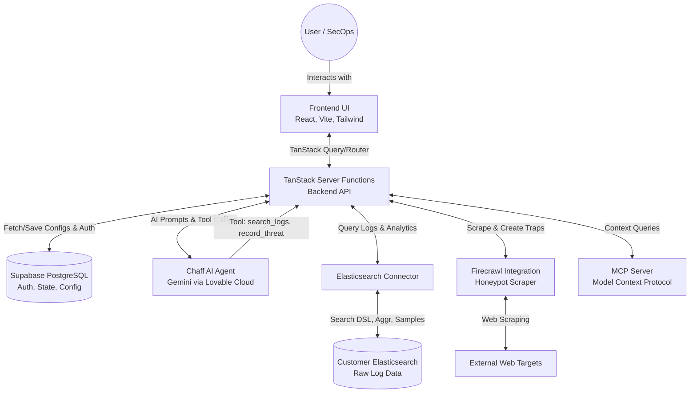

# Chaff - Technical Documentation

## Executive Summary
Chaff is an autonomous bot-traffic analyst and security mitigation system designed to detect and separate malicious bots (such as scrapers, credential stuffers, and scanners) from legitimate human traffic. By connecting directly to an organization's existing Elasticsearch logs, Chaff utilizes a sophisticated AI agent powered by Gemini (via Lovable Cloud) to continuously monitor, analyze, and report on traffic patterns. It provides actionable threat intelligence, creates automated honeypots using Firecrawl, and enables active mitigation through IP and User-Agent blocking rules.

## Table of Contents
1. [Executive Summary](#executive-summary)
2. [System Architecture](#system-architecture)
   - [Architecture Diagram](#architecture-diagram)
   - [Flow by Flow Explanation](#flow-by-flow-explanation)
3. [Detailed Feature & Agent Breakdown](#detailed-feature--agent-breakdown)
   - [The Chaff Agent (Autonomous AI Analyst)](#the-chaff-agent-autonomous-ai-analyst)
   - [Elasticsearch Integration & Dashboard (Threats)](#elasticsearch-integration--dashboard-threats)
   - [Honeypots & Traps](#honeypots--traps)
   - [Fingerprinting & Bot Classification Engine](#fingerprinting--bot-classification-engine)
   - [Campaigns](#campaigns)
   - [Live View](#live-view)
   - [Threat Emission & Scoring](#threat-emission--scoring)
   - [Block Rules & Mitigation](#block-rules--mitigation)
   - [MCP (Model Context Protocol) Server](#mcp-model-context-protocol-server)
4. [Conclusion](#conclusion)

---

## System Architecture

### Architecture Diagram

### Flow by Flow Explanation

1. **User Authentication & Initialization**
   - The User accesses the application and is authenticated via **Supabase Auth** (handled by `@lovable.dev/cloud-auth-js`).
   - The React frontend establishes a secure session. The user is prompted to connect their data source in the **Onboarding** flow.

2. **Connecting to External Data (Elasticsearch)**
   - The user inputs their Elasticsearch endpoint, API key, index pattern, and field mappings (timestamp, IP, user-agent, URL, status code).
   - The `es.server.ts` module securely tests this connection and saves the active configuration to **Supabase**.

3. **Data Analysis & Threat Detection via Chaff Agent**
   - The user navigates to the Agent interface and initiates a prompt (e.g., "Investigate unusual spikes in the last 24h").
   - The request hits the **TanStack Server Functions** (`agent.functions.ts`), where it constructs a system prompt for the **Chaff AI Agent** (powered by Google's Gemini through the Lovable Cloud API).
   - The Agent uses an autonomous loop to call specific backend tools (`search_logs`, `sample_requests`, `record_threat`).
   - `search_logs`: Translates the Agent's intent into an Elasticsearch DSL query, sending it to the **Customer Elasticsearch** via `es.server.ts`. It retrieves aggregated buckets (Top IPs, Top Paths, Traffic spikes).
   - The Agent analyzes the response, classifies User-Agents, determines if they are malicious bots or humans, and then calls `record_threat`.

4. **Recording and Visualizing Threats**
   - When the Agent calls `record_threat`, the finding is saved to the `threat_findings` table in **Supabase**.
   - The React frontend continuously pulls updates from Supabase via **TanStack Query** and visualizes them on the **Threats Dashboard**.

5. **Honeypot Creation (Firecrawl Flow)**
   - To catch bad actors proactively, the user utilizes the **Honeypots** feature.
   - The user inputs a target URL. The server function (`honeypots.functions.ts`) triggers the **Firecrawl API** to crawl the target site.
   - Firecrawl returns the structure (HTML, forms, links) of the page. Chaff then generates deceptive "Trap" pages simulating vulnerabilities (e.g., exposed admin panels, fake credentials) that legitimate users would never click, but scanners and bots would scrape.

6. **Block Rules & Mitigation**
   - Based on identified threats (from the Agent or triggered Honeypots), the user creates **Block Rules**.
   - These rules (by IP or User-Agent) are persisted in Supabase and can be exported or synchronized with external WAFs/Load Balancers to block malicious traffic at the edge.

7. **Extensibility via MCP Server**
   - The system hosts a **Model Context Protocol (MCP)** endpoint (`app.mcp.tsx`, `api/mcp.ts`). This allows external LLMs and AI coding assistants to securely query the Chaff configuration and context.

---

## Detailed Feature & Agent Breakdown

Every aspect of Chaff is designed to provide comprehensive bot-traffic analysis. Below is a detailed breakdown of all system features and agent capabilities.

### The Chaff Agent (Autonomous AI Analyst)
The core intelligence of the application resides in `agent.functions.ts`.
- **Purpose**: An autonomous loop driven by Google's Gemini model that acts as a Tier 1 Security Analyst.
- **Capabilities**:
  - **Tool Calling:** The agent is provided with native tools to inspect logs.
    - `search_logs`: Constructs highly complex Elasticsearch aggregations over specific time windows (e.g., retrieving `requests_per_minute`, `top_user_agents`, `ip_user_agents`).
    - `sample_requests`: Retrieves raw, unaggregated log documents to inspect exact HTTP headers and paths for deep forensics.
    - `record_threat`: An action tool that allows the Agent to formally document a discovered threat (Scraper, Credential-Stuffing, Scanner, Fake-Browser), assigning it a severity (low, medium, high, critical) and providing concrete IP/User-Agent evidence. This populates the "Threats" dashboard where SecOps can triage (mark as blocked, investigating, or dismiss).
- **Report Generation**: Users can explicitly ask the agent to generate and render a formatted PDF report summarizing its findings and investigations directly within the chat interface.
- **Operation**: The agent operates in a conversational loop. The user asks a question, the agent plans a query, executes the tool, evaluates the data, and either asks for more data or formulates a final markdown report for the user.

### Fingerprinting & Bot Classification Engine
Chaff contains a standalone heuristic scoring engine (`fingerprint.ts` and `bot-detect.ts`) that runs natively.
- **Purpose**: To mathematically evaluate individual beacons/requests and assign a precise verdict (human, suspect, bot, certified_bot).
- **User-Agent Classification (`bot-detect.ts`)**: Pure isomorphic regex pattern matching.
  - Matches against 25+ known bad automation patterns (`curl/`, `python-requests`, `HeadlessChrome`, `puppeteer`, `playwright`, `selenium`).
  - Matches against verified good bots (`googlebot`, `applebot`, `twitterbot`, `slackbot`, etc.).
  - Flags any UA lacking `mozilla`, `safari`, `chrome`, `firefox`, or `edge` as a non-browser bad bot.
- **Client-Side Behavioral Fingerprinting (`fingerprint.ts`)**: Evaluates deep client metrics.
  - Generates a stable signature hash using a 32-bit FNV-1a algorithm against the UA family, WebGL renderer, hardware concurrency, and viewport.
  - Assigns penalty points (0-100) based on signals:
    - `navigator.webdriver = true` (+60)
    - Missing `window.chrome` despite claiming a Chrome UA (+35)
    - Zero plugins (+15)
    - Canvas null/blocked (+20)
    - Software WebGL rendering like `llvmpipe` or `SwiftShader` (+40)
    - Anomalous behavior: Dwell time >2500ms with 0 mouse/scroll movements (+30), or a perfectly straight mouse path (entropy < 0.05) with >8 movements (+25).
    - Hardcoded exact headless default viewports like 800x600 (+8).
    - Direct honeypot URL hits trigger an immediate +100 score.

### Elasticsearch Integration & Dashboard (Threats)
- **Purpose**: To provide a unified view of the customer's web traffic without copying massive logs into Chaff's database.
- **Capabilities**:
  - **Dynamic Field Mapping:** Handles custom customer indexes by mapping required fields (`timestamp_field`, `ip_field`, `user_agent_field`, `url_field`, `status_field`).
  - **Threats Dashboard (`app.threats.tsx`):** Displays aggregated metrics (Total Requests, Bot vs. Human Traffic breakdown). It provides real-time time-series charts (via Recharts) and lists active threats recorded by the Agent.

### Honeypots & Traps
- **Purpose**: Proactive defense mechanism to identify and record bad actors before they hit production data.
- **Capabilities**:
  - **Site Crawling:** Uses Firecrawl (`@mendable/firecrawl-js`) to ingest the customer's legitimate website structure.
  - **Trap Generation (`app.honeypots.tsx`):** Automatically generates highly convincing decoy pages. These traps include hidden links (invisible to humans) that only aggressive crawlers and bots will follow. Once an entity visits a trap URL (e.g., `/trap/admin-login-backup`), its IP and User-Agent are instantly flagged as malicious.

### Campaigns
- **Purpose**: Structured, long-term investigations focused on specific traffic anomalies.
- **Capabilities (`app.campaigns.tsx`)**: The system continuously monitors Elasticsearch for grouped fingerprint events, aggregating findings into a dedicated campaign.
- **Analysis & Action (`app.campaigns.$id.tsx`)**: Within a specific campaign detail view, SecOps can:
  - View event counts, unique IPs, and average bot confidence scores.
  - Enrich the top IP address to uncover ASN and proxy/datacenter flags.
  - Export deployable mitigation block rules targeting the campaign's specific fingerprint. Formats include **Nginx** deny statements, **Cloudflare WAF** rules, and **iptables** DROP commands.
  - Formally mark the campaign as `active`, `monitoring`, or `resolved`.

### Live View
- **Purpose**: Provides a real-time, unaggregated stream of log events.
- **Capabilities**: Directly tails the connected Elasticsearch index to show raw requests as they happen, allowing SecOps to visualize traffic volume and immediately spot aggressive spikes before the Agent is even queried.

### Threat Emission & Scoring
- **Purpose**: To automatically score and filter malicious IPs using heuristics and intelligence.
- **Capabilities (`ip-intel.server.ts` & `rescan.server.ts`)**: When evaluating logs and conducting background rescans, Chaff uses a strict, multi-layered heuristic confidence scoring system (0-100) to determine if an IP is malicious.
- **Confidence Calculation Logic**:
  - **Base Score**: Any IP flagged for evaluation starts with a base confidence of **20**.
  - **Request Volume Penalties**: If an IP has a high event count in 24h, penalties are added: `+5` (>10 events), `+15` (>100 events), or `+25` (>1000 events).
  - **AbuseIPDB Integration**: External reputation scores apply penalties ranging from `+5` to `+35`. Residential proxies flagged by AbuseIPDB receive an additional `+20`.
  - **Reverse DNS (rDNS) & Infrastructure**:
    - If no rDNS record exists (often indicating residential proxies or fresh allocations), a `+10` penalty is applied.
    - Matches against known Datacenter patterns (AWS, DigitalOcean, Hetzner, etc.) add `+20`.
    - Matches against Tor exit node patterns add `+35`.
  - **Spoofed PTR Penalty**: If an rDNS lookup claims the IP belongs to a verified bot (like Googlebot), the system performs a forward-confirmation lookup. If the forward lookup fails to return the original IP, this is treated as a highly malicious spoofing attempt, adding a `+40` penalty.
  - **User-Agent Analysis**: Abnormally short UAs receive `+15`. Known automation UAs (e.g., `curl`, `python-requests`, `HeadlessChrome`, `selenium`) receive `+40`.
  - **Verified Bot Exclusion**: If the forward-lookup successfully confirms the IP belongs to a legitimate search engine or social crawler (Googlebot, Bingbot, Applebot, DuckDuckBot, Yandex, Facebook, LinkedIn, Ahrefs, Semrush), the confidence score is explicitly dropped to **0** and classified as a `verified_bot`.
- **Strict Filtering Logic**: To prevent alert fatigue and false positives, Chaff enforces a strict emission threshold. Threats are only automatically emitted to the `threat_findings` table (and thus the UI dashboard) if the calculated `confidence` is **>= 60** AND the IP is **not** classified as a `verified_bot`.

### Block Rules & Mitigation
- **Purpose**: To take action on the insights generated by Chaff.
- **Capabilities (`block-rules.ts`)**: Users can explicitly ban an IP or a User-Agent string. The system maintains this blocklist in Supabase. This list can be exported or integrated downstream to automatically update WAF (Web Application Firewall) rules.

### MCP (Model Context Protocol) Server
- **Purpose**: Seamless integration with external AI developer tools (like Cursor or other MCP clients).
- **Capabilities (`mcp.functions.ts` & `api/mcp.ts`)**: Hosts an MCP server allowing developers to query Chaff's threat intelligence context directly from their local IDE.
- **Security**: Access tokens are generated with random bytes, hashed via SHA-256 before being stored in Supabase (`mcp_tokens`), and verified securely during requests.
- **Exposed Tools**: The server exposes four distinct context tools:
  - `is_known_bot`: Checks if a specific IP has triggered honeypots or bot classifications.
  - `get_campaign`: Retrieves detailed metrics of a bot campaign using its ID or FNV-1a signature hash.
  - `list_recent_campaigns`: Returns a live list of currently active threats.
  - `lookup_fingerprint`: Inspects raw Elasticsearch events matching a specific fingerprint signature hash.

---

## Conclusion
Chaff represents a paradigm shift in log analysis. By keeping the heavy log data where it lives (Elasticsearch) and bringing the intelligence (Gemini Agent) to the data, Chaff minimizes latency and cost. Its robust feature set—ranging from automated AI investigations and external integrations via Firecrawl, to proactive Honeypot deployments—ensures comprehensive security against the growing landscape of automated web threats. Every agent and feature works seamlessly to separate the humans from the bots.
